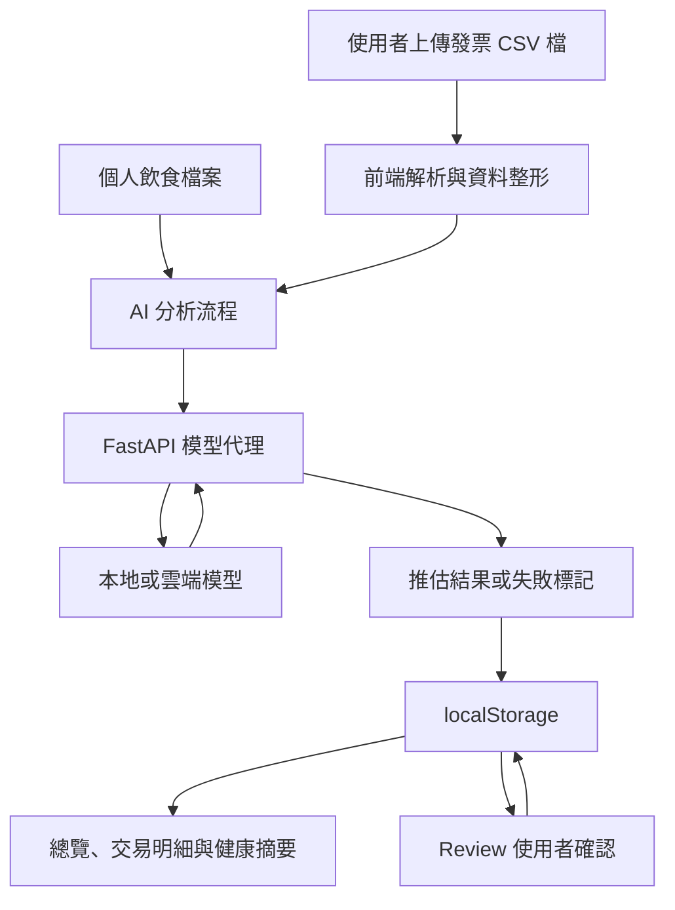

# 食溯 · Dietary Ledger

**電子發票載具資料 → 個人化飲食分析 → 健康參考摘要**

食溯是一個以電子發票消費紀錄為起點的飲食紀錄與健康資訊整理工具。本專案為黑客松 Demo，透過 AI 辨識食品與餐飲消費，推估本人食用量，並整理為可回溯、可理解的飲食紀錄，作為個人健康管理及與醫療專業人員溝通時的補充資訊。

## 核心引擎：Personalized Consumption Attribution Engine

**購買量 ≠ 實際攝取量。** 系統將購買資料轉換為「推估本人實際食用量」，並保留估計值、信心程度、推論理由與資料來源，讓使用者理解並確認分析結果。

## 1. 問題與目標

對經常外食、難以持續手動記錄飲食的使用者而言，日常消費紀錄是一個可利用的起點。然而，發票反映的是購買行為，未必能直接代表本人實際吃了多少，也無法單靠購買數量判斷是否與他人分食或留待日後食用。

本系統面向在台灣使用電子發票載具的消費者，希望利用既有消費資料降低飲食紀錄門檻。使用者自行匯入電子發票 CSV 檔後，由系統辨識食品相關項目、結合個人飲食資料進行推估，再將需要確認的項目交由使用者檢視。

預期成果是一份可持續累積與回顧的個人飲食紀錄；有健康管理或就醫需求時，使用者可主動提供整理後的摘要，協助說明長期飲食型態。

> 本產品不提供疾病診斷或治療，也不取代醫師、營養師等專業醫療建議。

## 2. 核心與附加功能

**核心**

- 透過雲端發票載具分析飲食習慣
- 專門針對飲食紀錄的 AI 問答

**附加**

- 個人健康飲食推薦
- 有需求時可於看診提供醫生飲食紀錄

## 3. 系統架構



- **前端**：處理 CSV 檔解析、交易資料整理、分析流程協調、頁面顯示與圖表呈現。
- **後端**：`backend/` 為薄 FastAPI 模型代理，將請求轉發至選定模型，處理模型存取並避免在前端暴露 API 金鑰。
- **模型**：負責食品分類與本人食用量推估；沒有離線規則引擎作為備援。
- **資料儲存**：將資料使用 Database 儲存。
- **外部資料**：目前使用使用者自行匯出的電子發票 CSV 檔，尚未自動串接載具 API 資料。

### 模型支援說明

技術表列出 DeepSeek／Gemini API；GPT 5.6 為原預計用於資料分析測試的 Sponsor 技術。

本 Demo 以「本地或雲端模型」描述架構，不視為上述供應商皆已完成串接。實際可選模型、連線設定與金鑰設定方式，需依專案程式碼及執行環境確認。

## 4. 技術棧

| 類型 | 技術／服務 | 用途 |
| --- | --- | --- |
| 前端框架 | React 18、TypeScript、Vite | 應用程式與開發建置 |
| 樣式與元件 | Tailwind CSS、shadcn/ui、Radix primitives | 介面與互動元件；UI primitives 位於 `src/components/ui` |
| 圖表 | Recharts | 飲食分析視覺化 |
| 路由 | React Router | 頁面導覽 |
| 後端 | Python、FastAPI、Uvicorn | 模型請求代理與 API 服務 |
| AI | 本地模型或雲端模型 API | 食品分類與食用量推估；供應商支援待確認 |
| 儲存 | Sqlite | Demo 資料保存 |

## 5. 安裝與執行

### 環境準備

- 安裝 Node.js 與 npm。
- 安裝 Python，並確保可建立虛擬環境。
- 準備可連線的模型服務；若使用雲端 API，需完成後端所需的金鑰與模型設定。
- 在含有 `package.json` 與 `backend/` 的專案根目錄執行下列步驟。

### 5.1 啟動後端

在第一個終端機執行。

Windows PowerShell：

```powershell
cd backend
python -m venv .venv
.\.venv\Scripts\python.exe -m pip install -r requirements.txt
.\.venv\Scripts\python.exe -m uvicorn main:app --host 0.0.0.0 --port 8000 --reload
```

macOS／Linux：

```bash
cd backend
python3 -m venv .venv
.venv/bin/python -m pip install -r requirements.txt
.venv/bin/python -m uvicorn main:app --host 0.0.0.0 --port 8000 --reload
```

### 5.2 啟動前端

另開第二個終端機，在專案根目錄執行：

```bash
npm install
npm run dev
```

開啟 <http://localhost:5173> 。首次使用會進入 Onboarding，建立個人飲食檔案並選擇可用模型。

依原技術文件，Vite 開發環境已將 `/api` 代理至後端 8000 埠。要完成 AI 分析，前端、後端及所選模型服務都必須可正常連線。

### 5.3 建置與本機預覽

在專案根目錄執行：

```bash
npm run build
npm run preview
```

`npm run build` 產生 `dist/`，`npm run preview` 用於本機預覽建置成果。靜態檔案本身不包含模型服務；預覽或部署環境仍需確認 `/api` 可連至後端，不能直接假定沿用開發環境的代理設定。

## 6. 使用流程與頁面

1. 首次開啟系統，完成 Onboarding 與個人飲食檔案。
2. 選擇執行環境支援的模型，確認後端及模型服務可連線。
3. 使用內建 Demo 資料，或到 Upload Data 上傳自訂 CSV 檔。
4. 等待分析後，在 Overview 查看月度總覽。
5. 到 Transactions 查看交易明細與推估理由，並在 Review 檢視待確認項目。
6. 提供下載按鈕，導出飲食分析報告。
7. 如有分析失敗，可至 Settings 重試；需要回復內建範例時，可重設 Demo 資料。

### 路由

| 路由 | 頁面 | 主要用途 |
| --- | --- | --- |
| `/` | Overview | 月度飲食 Dashboard |
| `/upload` | Upload Data | 拖放上傳與分析進度動畫 |
| `/profile` | Dietary Profile | 查看及編輯個人飲食檔案 |
| `/transactions` | Transactions | 交易表格與可解釋側邊詳情面板 |
| `/review` | Review | 月度待確認項目收件匣 |
| `/settings` | Settings | 設定、重試分析、重設 Demo 資料 |
| `/onboarding` | Onboarding | 首次使用的卡片式 Profile 問卷 |

## 7. 資料格式與 Demo 情境

### CSV 檔格式

依技術文件，`src/data/sampleInvoice.csv` 採用財政部電子發票整合平台的實際匯出格式，包含：

- 商品名稱、購買日期、商品價格。
- 折扣、出清等負數列。
- 食品及非食品項目，例如汽油、日用品與運動用品。

`src/utils/einvoiceParser.ts` 負責解析此格式。使用者可上傳自行下載、符合支援格式的 CSV 檔。

### 示範情境

內建範例加入以下項目，展示庫存、多人份量與待確認情境：

| 範例 | 預期展示的推估行為 |
| --- | --- |
| 可口可樂 6 入 | 可久放的庫存型飲料，可能推估為分散數天由本人飲用 |
| 便當 × 4 | 超出個人單餐典型份量，信心不足時進入 Review |
| 波霸紅茶拿鐵 × 3、巧克力蛋糕 × 3 | 大量易腐食品，需要確認本人實際食用份量 |

食品分類與食用量由 AI 分析，以上為示範意圖；實際結果可能隨模型回應改變，並非固定數值。

### 資料覆寫與還原

上傳自訂檔案後，`/upload` 會沿用相同分析流程重新分析，並覆寫目前存於 localStorage 的資料。可透過 Settings → 重設 Demo 資料 還原內建範例。

## 8. 分析失敗處理

本專案沒有離線規則引擎備援。模型呼叫失敗、逾時，或回應遺漏部分交易時，受影響項目會標記為「分析失敗」。

失敗狀態會顯示於 Dashboard 頂部提示、Transactions 表格及交易詳情面板。確認後端與模型連線恢復後，可於 Settings → 重試分析 再次處理。

## 9. 專案目錄

```
backend/                          FastAPI 模型代理
src/
  components/                     Sidebar、Header、圖表、交易表格、ReviewCard、詳情面板
    ui/                           shadcn/ui primitives
  pages/                          各路由頁面
  data/
    sampleInvoice.csv             發票匯出格式範例
  lib/                            store（localStorage）、analytics（彙整／推論）、colors、utils
  services/
    api.ts                        API 存取
    llmFoodUnderstanding.ts        模型食品理解服務
  types/
    index.ts                      型別定義
  utils/
    einvoiceParser.ts             CSV 檔解析
    processing                    CSV 檔 至 Transaction 的結構整形
    modelPipeline                 AI 分類與食用量推估流程
```

## 10. 已知限制與未來工作

| 項目 | 目前限制 | 後續方向 |
| --- | --- | --- |
| 載具自動匯入 | 目前採使用者自行上傳單月 CSV 檔，尚未串接自動匯入 | 確認平台開發者資格、申請與授權條件，並評估合作串接 |
| 發票資訊完整性 | 依企劃文件，使用中的 CSV 檔缺少足以判定同餐購買的精確時間等資訊 | 補充使用者確認機制及更完整的資料來源 |
| 實際攝取量 | 購買可能涉及分食、庫存或非本人食用 | 改善個人化推估與確認流程 |
| 模型連線與結果 | 依賴可用模型服務；回應可能變動、失敗或遺漏 | 改善穩定性、錯誤處理與分析品質驗證 |
| 醫療應用 | 團隊目前無醫事專業成員，尚缺乏專業驗證 | 與醫療及營養專業團隊合作，評估健康管理與預防醫學應用 |

團隊目前不具備財政部 API 開發者申請身分，本專案現階段因此採 CSV 檔上傳方式；未來是否可串接 API，仍需依平台實際資格、審核與授權條件確認。

## 11. 第三方服務、資料與素材

| 來源／服務 | 用途 | 使用與授權說明 |
| --- | --- | --- |
| 財政部電子發票整合服務平台 | 發票資料與匯出格式來源 | 使用者自行取得並上傳其有權使用的資料；平台 API 串接資格及條件需另行確認 |
| Google Gemini API | 企劃與預覽文件列出的模型服務 | 原企劃稱「免費授權」；本文件不將其視為無限制授權，使用方案、額度及條款需另行確認 |
| GPT 5.6（Sponsor 技術） | 原企劃預計用於資料分析測試 | 原文件未確認實際採用情況 |

## 12. 作品展示

- 評選影片：待補。

## 13. 團隊成員

| 姓名 | 暱稱 | GitHub 帳號 | 分工 |
| --- | --- | --- | --- |
| 徐瑋喬 | Ch1aooo | Ch1aoooo | 後端開發 |
| 金暄庭 | 小金 | 57ocnn | 前端開發 |
| 陳彥翰 | Ian Chen | YenHan9001 | 後端開發 |
| 葉亭儀 | ty | yty1222 | 文件整理 |
| 喻子勳 | yzx141310764 | Yzx141310764 | 品質驗證 |

## 14. License

本專案採 [MIT License](LICENSE) 授權（見儲存庫根目錄的 `LICENSE` 檔）。

MIT 僅涵蓋本專案自行撰寫的程式碼。第三方服務、資料與素材（財政部電子發票資料與匯出格式、Google Gemini API、其他 Sponsor 技術等）之使用條件、授權與額度，請依各來源的實際條款確認，詳見第 11 節。
